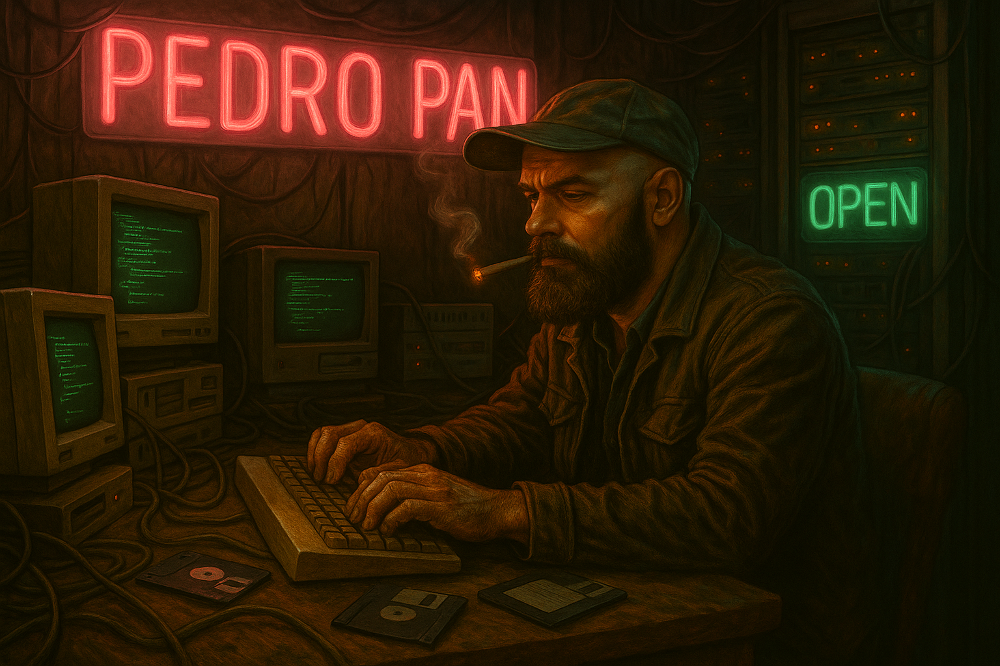

  # Heya, I'm Pedro-Pan 🌿  Like Peter Pan, but from the South 🤓
  

  ---

  ## 💻 Tech Stack

  <table>
    <tr>
      <td align="left" width="33%">
        <h3>⚡ Core Technologies</h3>
        <ul align="left">
          <li>🐧 <strong>OS:</strong> Linux</li>
          <li>🚀 <strong>Deployment:</strong> Heroku</li>
          <li>🧰 <strong>Tools:</strong> Git, Docker, VSCode, Postman, Tmux</li>
          <li>🧪 <strong>Testing:</strong> RSpec, Minitest, Capybara</li>
        </ul>
      </td>
      <td align="center" width="33%">
        <h3>🔧 Languages & Frameworks</h3>
        

          <!-- Languages -->
          &nbsp;&nbsp;
          &nbsp;&nbsp;
          
        

         
        

          <!-- Frameworks -->
          &nbsp;&nbsp;
          &nbsp;&nbsp;
          
        

      </td>
      <td align="left" width="33%">
        <h3>🗂️ Data & Markup</h3>
        <ul align="left">
          <li>📊 <strong>Data:</strong> JSON, YAML, CSV, XML</li>
          <li>🎨 <strong>Frontend:</strong> HTML, CSS, Markdown</li>
          <li>📝 <strong>Templates:</strong> ERB</li>
        </ul>
      </td>
    </tr>
  </table>

  ## 📊 GitHub Stats
  

    
  

  

    
  

